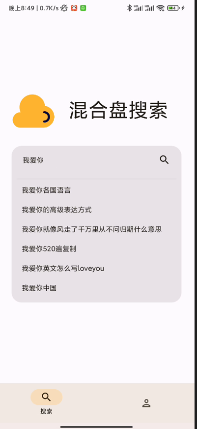
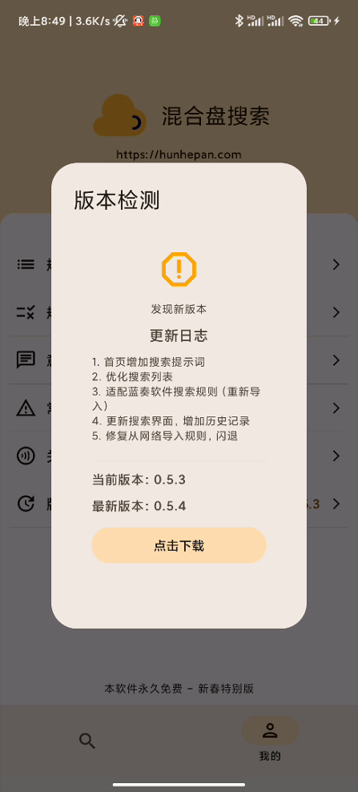
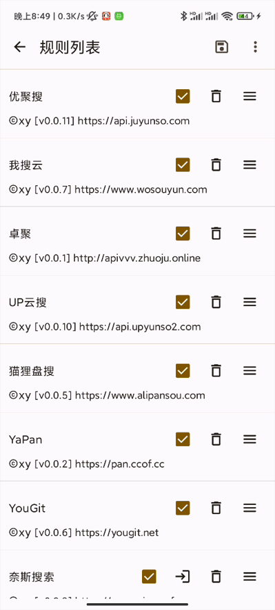
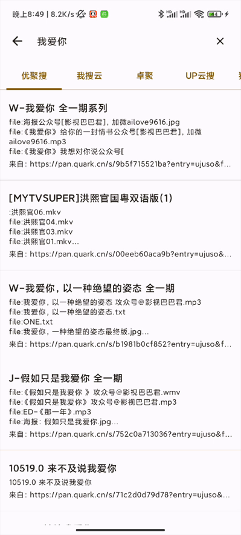

## 混合盘

混合盘是一个规则引擎APP，只提供核心能力（比如：网络访问），并不提供具体实现

你可以在规则中心下载你需要的规则，或者自己编写规则，然后上传到规则中心，供其他人使用

规则中心目前提供【网盘】【磁力】规则

这全部是免费的。

> 混合盘PC版本发布了：https://github.com/misiai/hunhepan

**官网：**

https://hunhepan.com

**支持：**

现在混合盘支持【网盘】【磁力】搜索规则，在上面的官网的规则中心就可以导入这两种规则；

## 下载

https://wwb.lanzouw.com/b037ns0eb   密码：g361

## 使用

**下载后，记得在路径：“关于-规则列表-三个点-导入默认”，中导入默认规则，这样才能正常使用软件哦。**

## 截图

  
